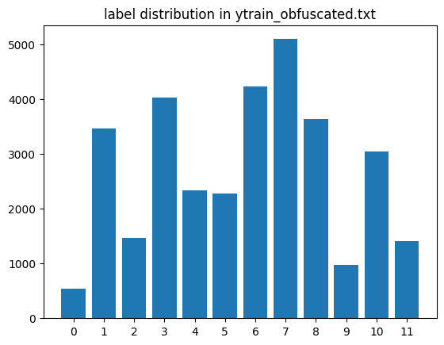
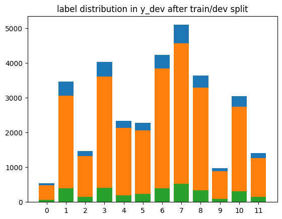

# Author

Dr. Mohsen Mesgar
[mohsen-mesgar.io](https://mohsen-mesgar.io/).


# Introduction
- **Goal:** 
    I aim at classifying sentences to the specific novel to which they belong. 
    Input to the model is an obfuscated text, and the output should be an integer indicating a novel ID. 
    In total, there are 12 novel IDs indexing from 0. 

- **Why is this goal difficult to achieve?** 
  This task is highly challenging because the sentences in this dataset are obfuscated. The pattern used to obfuscate the sentences is unknown. This means pretrained tokenizer models (which are used in state-of-the-art pretrained language models like BERT, GPT, RoBERTa, etc) cannot be (directly) applied to these texts. 
  In early experiments, I tried out a BERT-based model and tokenizer (``main-transformers.py``). 
  The accuracy of this model was very low. 
  
- **My idea:**
   I rely on characters and the order they appear in a sentence to represent a sentence by a vector to machine learning models. 
   The advantages of this idea are that (1) there is no need for tokenizing the sentences to words, and (2) the vocabulary size for neural models remains small. 
   However, its disadvantage is that the length of sentences (in terms of the number of characters) is long and consequently encoding characters considering all characters in a sentence becomes very challenging. 
   To overcome this issue, I propose two solutions: 
   
   (1) I use a **convolutional** neural model. I convolve neighboring characters with multiple kernels to obtain feature representations of different portions of a sentence. Then use these feature representations of the sentence to identify its novel label.
   
   (2) I use a **Bidirectional** LSTM model as it is able to learn the sequential order of characters.  

# Submission
I explain where to obtin the following items requested to be included in the submission:

✅ **your predictions in a file named ytest.txt (in the same format as ytrain.txt)** 
    
  - As ytest.txt, you might use the predictions of the CNN model saved in the following file:
   
    ```bash
    ./ytest-best-model-cnn-seed-0.txt 
    ```

✅ **Expected accuracy on the test set**
    
   - The CNN model is expected to achieve accuracy about 
       ```bash
        acc = 80 %
        ```

✅ **the source code for training and prediction (< 10MB)**
    
   - The CNN model is implemented in the  
    ```neural_models.py```
     file. 
   
✅ **a brief description of your method (optional)**
    
   - Please read this file or ``README.md``. 

# Data 🗄️
- I was given a training set and a test set. The following Table shows the number of sentences in these sets

|         | train_obfuscated | test_obfuscated |
| :---:   |     :---:        |          :---:  |
| # of samples |  32,512            |     3,000        |


- I split the training set into two sets: one for training and one for validation.
The goal is to use the validation set to 1) estimate the accuracy on the given test_obfuscated.txt 
and 2) to pick up the best model during training. 
    
    - I use ratio 0.9(train)/0.1(validation) to randomly split the train_obfuscated.txt.
     This ration ensures that the validation set and the given test_obfuscated.txt are almost in a similar size, i.e., about 3000. 

    - Following Table shows some statistics of training and validation sets after the spiting process
    
    
|         | training | validation | test
| :---:   |     :---:    | :---:  |  :---:  |
| # of samples |  29,260    |    3,252    |    3000   |


- Let's check how balanced is the dataset? 

    - I first compute the distribution of novel IDs in ytrain_obfuscated.txt (see the following Table). 
    We see that the class labels (or novel ID) are very imbalanced. 
    The most frequent label is label 7 (which is associated with novel ``moby_dick``), and the least frequent one is label 0 (which is associated with novel ``alice_in_wonderland``). 
    
    - The following Table also shows the distribution of labels in the train and validation sets.  
    
    |novel ID |Count in ytrain|% in ytrain|Count in train set|% in train set|Count in validation set|% in validation set|
    | :---:   |     :---:  | :---:  | :---:  | :---:  | :---:  | :---:  |  
    |0|543|1.67|475|1.69|68|2.09|
    |1|3,459|10.64|3,109|11.05|350|10.76|
    |2|1,471|4.52|1,317|4.68|154|4.74|
    |3|4,022|12.37|3,615|12.85|407|12.52|
    |4|2,337|7.19|2,111|7.5|226|6.95|
    |5|2,283|7.02|2,052|7.3|231|7.1|
    |6|4,226|13|3,805|13.53|421|12.95|
    |7|5,097|15.68|4,590|16.32|507|15.59|
    |8|3,634|11.18|3,287|11.69|347|10.67|
    |9|980|3.01|888|3.16|92|2.83|
    |10|3,052|9.39|2,754|9.79|298|9.16|
    |11|1,408|4.33|1,257|0.44|151|4.64|
    |sum|32,512|100|29,260|100|3,252|100|

    - The following Figures illustrate the imbalance property of labels in the given training/dev sets before and after spliting process (seed=0). 
    To keep the task challening, we retain this property of the data in training/dev splits as well.  
     
    
    
    
    
    


# Compared Models
We compare the following models:
* **Random:** 
This baseline uses a uniform distribution over labels to randomly assign a label to each sentence in the dev/test set. 

* **Majority:**
 As I showed above, distributions of sentences over labels are not balanced. 
 Therefore, an informative baseline is a model which assigns the most frequent label in the training set to any sentence in the dev/test set. 
 This baseline lets us study how well a model performs if it becomes biased towards the most frequent label. 
 
* **LogReg:** 
I use the logistic regression (LogReg) model as a strong machine learning model (I'll show it in the results), which does not use neural networks. 
LogReg does not use any embeddings. 
Instead, it uses uni-, bi-, and tri-gram characters as features and represents a sentence based on the TF-IDF weights of features in the sentence. 
 

* **MLP:**
I define a multilayer perceptron as the most straightforward neural network to learn from vector representations of sentences. 
To obtain sentence vectors, I define a lookup table that assigns an embedding vector (which is randomly initialized) to any character that appears in the training sentences. 
A sentence vector is obtained by applying a mean pooling over embeddings of its characters. 
A sentence vector is fed to three MLP layers with the `ReLU` activation function and then 
the output is transformed to ``logits`` of labels using a linear MLP layer. 

* **BiLSTM:**
In this model, I define a bidirectional LSTM layer to consider character embeddings in their sentence-level context. 
My main motivation for using bi-directional (vs unidirectional) LSTM is to consider long-distance relations between characters in a sentence. 
This is challenging for unidirectional LSTMs on these sentences because sentences are very long (in terms of the number of characters). 

* **CNN**
In this model, I convolve the emebeddings of neighbouring characters to obtain their feature representations. 
To consider a character in its short and long context (in terms of number of neighbouring characters)  in a setence, 
I define 9 convolution  windows with sizes from 3 to 11 with step_size=1. 
For each convolution window, I use 100 kernels. 
I use a max-pooling over windows with the same size, to obtain most informative feature. 
These features are concatenated to be used for identifying the label. 
  
# Results  
The following Table compares the performance the examined models.  
I ran experiments for three runs with different seed values (0,1, and 2). 
Note that the training-dev sets in different runs might be different, which is useful because it almost simulates the 3-fold cross-validation method for evaluation. 
However, I emphasize that the data splits obtained with each seed are identical for all models. 
So, the following comparisons between models are fair as they are trained and evaluated on the same data sets.    
On the other hand, running experiments several times with different seeds alleviates the chance of achieving good or bad accuracy because of randomness. 
I report the average accuracy achieved by each model in three runs. 
This average performance should be a better estimation of the accuracy on the test set. 
The numbers in paratheses show the standard deviation of the accuracy scores in these runs. 
  


 |Model| average accuracy (%) on dev set | Average Execution Time (Seconds) | 
 | :---:   |     :---:  | :---:  | 
 | Random | 08.34 (0.33) |0.19 |
 | Majority | 16.58 (0.26) |0.13 |
 | LogReg| 75.82 (0.60) | 106.7 |
 | MLP|  32.54 (0.29) | 1,807.76 | 
 | CNN | 80.97 (0.43) |  1,2218.04 |
 | BiLSTM|  78.87 | 5925.36 |  
  
# Conclusions and Future work 🛫

In this project, the CNN model could learn to extract features from character embeddings of a sentence. 
Using these features, our model achieves the highest performance compared with the examined models. 
In the future, one might try out attention layers  on top of BiLSTM layers. 
Attentions have been shown to significantly help in learning long-distance relations between BiLSTM states. 
Although the results of BERT in my early experiments is low, Transformers with their multihead attentions (without any pretraining)
may learn the property of the sentences in this dataset as well. 
A further future work is to tokenize sentences by byte-pair-encoding algorithm.  
This method learns a tokenzier based on the frequency of subsequent characters in sentences from the training set. 
This method has been improved the performance on neural machine translaion models for many languages. 
So it might be useful for this task as well. 
For more details about the models used in this project and also possible future work, 
please refer to the [DL for NLP 2021](https://github.com/dl4nlp-tuda2021/deep-learning-for-nlp-lectures) course that I gave at the computer science department of the Technical University of Darmstadt. 

 

# How to Run 🔥
## Conda Environment and GPU Specifications
- I implemented all models in pyTorch. 
Please install a conda environment and all required packages as follows:
``` bash
conda install -c psi4 gcc-5

pip install -r requirement.txt
```

- GPU:
``
Tesla P100-PCIE-16GB
``

## Running Experiments
To run the experiments, one should replace the ``[METHOD]`` place holder in the following script with the name of the method that is the target. 
``[METHOD]`` should be chosen from the following list ``random|majority|logreg|mlp|cnn|bilstm|``.
```bash
METHOD=[METHOD]
SEEDS=(0 1 2)
for SEED in ${SEEDS[@]};
   do
        python main.py --method $METHOD --seed $SEED > log-model-$METHOD-seed-$SEED.txt
   done
```

As an example, to run the random baseline one should the following script:


```bash
METHOD=cnn
SEEDS=(0 1 2)
for SEED in ${SEEDS[@]};
   do
        python main.py --method $METHOD --seed $SEED > log-model-$METHOD-seed-$SEED.txt
   done
```
 


